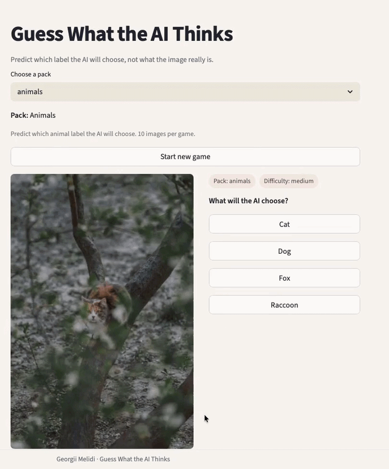

# Guess What the AI Thinks

**Live Demo:** https://guess-what-ai-thinks.streamlit.app/

An interactive game where you try to predict what a vision-language model will say about an image.

This is not about guessing the correct answer.  
It is about understanding how the model perceives the world.

---

## Idea

Given an image and a small set of possible labels, the model assigns probabilities to each label.

Your task is to guess which label the model will choose.

Sometimes the model is obvious.  
Sometimes it is confidently wrong.

---

## Packs

- Animals  
- Food  
- Tech Objects  
- Illusions  

Each pack is designed to highlight different types of model behavior.

---

## How it works

- Model: SigLIP (`google/siglip2-base-patch16-224`)
- We define a custom set of labels for each pack
- The model scores each label against the image
- We convert scores into probabilities
- The game shows the top predictions

---

## Run locally

```bash
git clone https://github.com/YOUR_USERNAME/guess-what-ai-thinks.git
cd guess-what-ai-thinks

python3 -m venv .venv
source .venv/bin/activate

pip install -r requirements.txt
python -m streamlit run app/streamlit_app.py
```

---

## Example



---

## Game flow

1. Select a pack  
2. Look at the image  
3. Choose what you think the AI will predict  
4. Reveal the model’s answer and confidence  
5. Continue and track your performance  

---

## Features

- Multiple curated packs (animals, food, tech objects, illusions)  
- Vision-language model scoring (SigLIP)  
- Top-3 predictions with probabilities  
- Game statistics (score, accuracy, streak)  
- Randomized questions for replayability  

---
## © Author

Melidi Georgii, 2026

This project is released under the MIT License.
